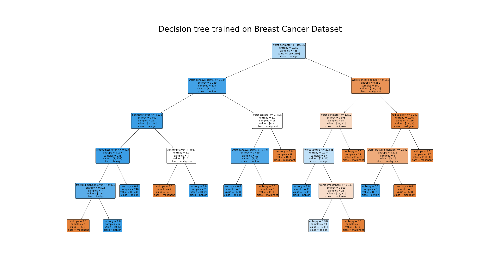

# Breast Cancer

breast cancer dataset from **sklearn** library.

- malignant: cancer
- benign: not cancer

## Dataset Description

```
Breast cancer wisconsin (diagnostic) dataset  
--------------------------------------------

Data Set Characteristics:

    :Number of Instances: 569

    :Number of Attributes: 30 numeric, predictive attributes and the class

    :Attribute Information:
        - radius (mean of distances from center to points on the perimeter)
        - texture (standard deviation of gray-scale values)
        - perimeter
        - area
        - smoothness (local variation in radius lengths)
        - compactness (perimeter^2 / area - 1.0)
        - concavity (severity of concave portions of the contour)
        - concave points (number of concave portions of the contour)
        - symmetry
        - fractal dimension ("coastline approximation" - 1)

        The mean, standard error, and "worst" or largest (mean of the three
        worst/largest values) of these features were computed for each image,
        resulting in 30 features.  For instance, field 0 is Mean Radius, field
        10 is Radius SE, field 20 is Worst Radius.

        - class:
                - WDBC-Malignant
                - WDBC-Benign

    :Summary Statistics:

    ===================================== ====== ======
                                           Min    Max
    ===================================== ====== ======
    radius (mean):                        6.981  28.11
    texture (mean):                       9.71   39.28
    perimeter (mean):                     43.79  188.5
    area (mean):                          143.5  2501.0
    smoothness (mean):                    0.053  0.163
    compactness (mean):                   0.019  0.345
    concavity (mean):                     0.0    0.427
    concave points (mean):                0.0    0.201
    symmetry (mean):                      0.106  0.304
    fractal dimension (mean):             0.05   0.097
    radius (standard error):              0.112  2.873
    texture (standard error):             0.36   4.885
    perimeter (standard error):           0.757  21.98
    area (standard error):                6.802  542.2
    smoothness (standard error):          0.002  0.031
    compactness (standard error):         0.002  0.135
    concavity (standard error):           0.0    0.396
    concave points (standard error):      0.0    0.053
    symmetry (standard error):            0.008  0.079
    fractal dimension (standard error):   0.001  0.03
    radius (worst):                       7.93   36.04
    texture (worst):                      12.02  49.54
    perimeter (worst):                    50.41  251.2
    area (worst):                         185.2  4254.0
    smoothness (worst):                   0.071  0.223
    compactness (worst):                  0.027  1.058
    concavity (worst):                    0.0    1.252
    concave points (worst):               0.0    0.291
    symmetry (worst):                     0.156  0.664
    fractal dimension (worst):            0.055  0.208
    ===================================== ====== ======

    :Missing Attribute Values: None

    :Class Distribution: 212 - Malignant, 357 - Benign

    :Creator:  Dr. William H. Wolberg, W. Nick Street, Olvi L. Mangasarian

    :Donor: Nick Street

    :Date: November, 1995
```

This is a copy of UCI ML Breast Cancer Wisconsin (Diagnostic) datasets. https://goo.gl/U2Uwz2  

Features are computed from a digitized image of a fine needle aspirate (FNA) of a breast mass.  
They describe characteristics of the cell nuclei present in the image.  


## Predict with your own data

```py
import pickle
import numpy as np
import pandas as pd


# load trained model to use with your data
def load_model():
    return pickle.load(open("./assets/model.pkl", "rb"))


# load model
TREE = load_model()

# load dataframe
DF = pd.read_csv("./assets/cancer.csv")

# get feature names
feature_names = DF.columns[:-1]
features = np.ones((1, len(feature_names)))

# user input
for i, name in enumerate(feature_names):
    min_val = DF[name].min()
    max_val = DF[name].max()

    # print range for each features
    print(f"{i + 1:02}.) {name} = [{min_val:.2f}, {max_val:.2f}]")
    data = input(f"Enter your {name}: ").strip()
    features[0, i] = data if data else DF[name].mean()

# input : 2D array (1, 30)
features = features.astype(np.float64)
prediction = TREE.predict(features)

# output : 2D array
if prediction[0] == 0:
    print("\nMalignant, You got a cancer.")
else:
    print("\nBenign, You have no cancer.")
```

## Decision Tree

